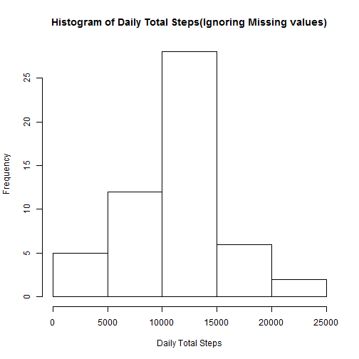
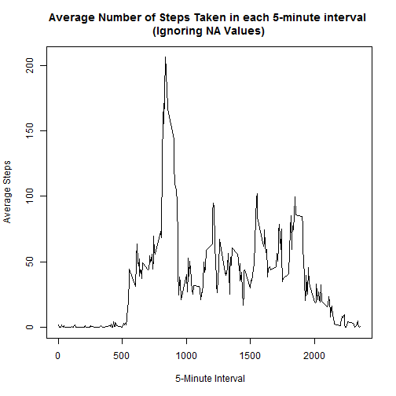
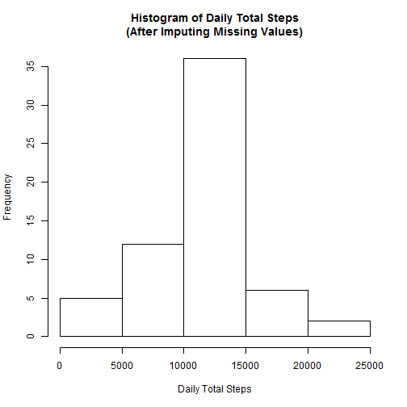
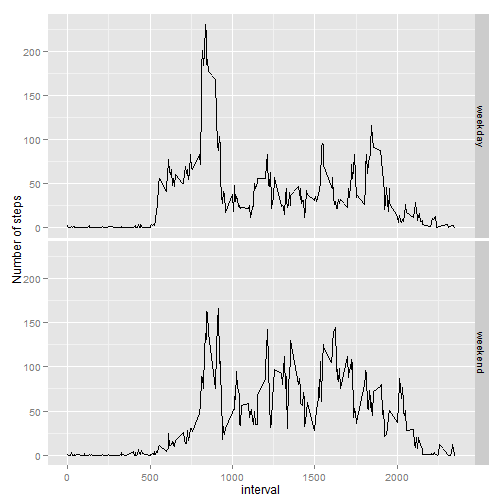

# Reproducible Research: Peer Assessment 1


## 1. Loading and preprocessing the data

1.1 Below code will create a directory "Data" under current working directory if it is not already exists


```r
if (!file.exists("Data")) {
    dir.create(file.path("Data"))
}
```


1.2 Download the source data file using below URL

```r
fileurl = "https://d396qusza40orc.cloudfront.net/repdata%2Fdata%2Factivity.zip"
```


1.3 As tte url using "https" we need to check the OS. As on anything except windows we should use method = "curl" in case of "https".

```r
setInternet2(use = TRUE)
if (Sys.info()["sysname"] == "Windows") {
    download.file(fileurl, "./Data/activity.zip")
} else {
    download.file(fileurl, "./Data/activity.zip", method = "curl")
}
```


1.4 Extact the zip file

```r
unzip("./Data/activity.zip", files = "activity.csv", exdir = "./Data")
```


1.5 Load data from from file to variable "activity"


```r
activity <- read.csv("./Data/activity.csv")
```


1.6 Check the property of data.

```r
names(activity)
```

```
## [1] "steps"    "date"     "interval"
```

```r
head(activity)
```

```
##   steps       date interval
## 1    NA 2012-10-01        0
## 2    NA 2012-10-01        5
## 3    NA 2012-10-01       10
## 4    NA 2012-10-01       15
## 5    NA 2012-10-01       20
## 6    NA 2012-10-01       25
```

```r
str(activity)
```

```
## 'data.frame':	17568 obs. of  3 variables:
##  $ steps   : int  NA NA NA NA NA NA NA NA NA NA ...
##  $ date    : Factor w/ 61 levels "2012-10-01","2012-10-02",..: 1 1 1 1 1 1 1 1 1 1 ...
##  $ interval: int  0 5 10 15 20 25 30 35 40 45 ...
```

```r
summary(activity$steps)
```

```
##    Min. 1st Qu.  Median    Mean 3rd Qu.    Max.    NA's 
##     0.0     0.0     0.0    37.4    12.0   806.0    2304
```

```r
summary(activity$interval)
```

```
##    Min. 1st Qu.  Median    Mean 3rd Qu.    Max. 
##       0     589    1180    1180    1770    2360
```


- Above we can see there are too many NA values in "steps" column.

1.7 Convert date column as date.

```r
activity$date <- as.Date(activity$date)
```


1.8 Convert frame to table to utilize some of the aggratation options.

```r
library(data.table)
activityTbl <- data.table(activity)
```


## 2. What is mean total number of steps taken per day?

2.1 Histogram of the total number of steps taken each day (ignore the missing values in the dataset).

```r
dailyTotalSteps <- activityTbl[!is.na(steps), sum(steps), by = date]
setnames(dailyTotalSteps, names(dailyTotalSteps), c("dates", "total.steps"))

hist(dailyTotalSteps$total.steps, xlab = "Daily Total Steps", main = "Histogram of Daily Total Steps(Ignoring Missing values)")
```

 

2.2 Calculate and report the mean and median total number of steps taken per day(ignore the missing values in the dataset).

- mean of "total number of steps taken per day"

```r
mean(dailyTotalSteps$total.steps)
```

```
## [1] 10766
```


- median of "total number of steps taken per day"

```r
median(dailyTotalSteps$total.steps)
```

```
## [1] 10765
```


## 3. What is the average daily activity pattern?
3.1 Make a time series plot (i.e. type = "l") of the 5-minute interval (x-axis) and the average number of steps taken, averaged across all days (y-axis)


```r
agvIntervalSteps <- activityTbl[!is.na(steps), mean(steps), by = interval]
setnames(agvIntervalSteps, names(agvIntervalSteps), c("interval", "average.steps"))

plot(agvIntervalSteps$interval, agvIntervalSteps$average.steps, type = "l", 
    xlab = " 5-Minute Interval", ylab = "Average Steps", main = "Average Number of Steps Taken in each 5-minute interval \n(Ignoring NA Values)")
```

 


3.2 Which 5-minute interval, on average across all the days in the dataset, contains the maximum number of steps?

```r
agvIntervalSteps[average.steps == max(agvIntervalSteps$average.steps), interval]
```

```
## [1] 835
```


## 4. Imputing missing values

4.1 Calculate and report the total number of missing values in the dataset (i.e. the total number of rows with NAs)
Total number of missing values:

```r
nrow(activityTbl[is.na(steps), ])
```

```
## [1] 2304
```


4.2 Here our *strategy* to imput missing values for "steps" with the "mean for the corresponding 5-minute interval" (calculated in step 3.1 above)

4.3 Create a new dataset that is equal to the original dataset but with the missing data filled in.

- Create the dataset with imputed missing values

```r
activityImput <- data.frame(activityTbl)
for (i in 0:max(activityImput$interval)) {
    activityImput[is.na(activityImput$steps) & activityImput$interval == i, 
        1] <- agvIntervalSteps[interval == i, average.steps]
}
activityImput <- data.table(activityImput)
```


- check the property of data after imputing missing value.  

```r
head(activityImput)
```

```
##      steps       date interval
## 1: 1.71698 2012-10-01        0
## 2: 0.33962 2012-10-01        5
## 3: 0.13208 2012-10-01       10
## 4: 0.15094 2012-10-01       15
## 5: 0.07547 2012-10-01       20
## 6: 2.09434 2012-10-01       25
```

```r
str(activityImput)
```

```
## Classes 'data.table' and 'data.frame':	17568 obs. of  3 variables:
##  $ steps   : num  1.717 0.3396 0.1321 0.1509 0.0755 ...
##  $ date    : Date, format: "2012-10-01" "2012-10-01" ...
##  $ interval: int  0 5 10 15 20 25 30 35 40 45 ...
##  - attr(*, ".internal.selfref")=<externalptr>
```

```r
summary(activityImput$steps)
```

```
##    Min. 1st Qu.  Median    Mean 3rd Qu.    Max. 
##     0.0     0.0     0.0    37.4    27.0   806.0
```

```r
summary(activityImput$interval)
```

```
##    Min. 1st Qu.  Median    Mean 3rd Qu.    Max. 
##       0     589    1180    1180    1770    2360
```

- seems there is no NA values above

4.4 Make a histogram of the total number of steps taken each day and Calculate and report the mean and median total number of steps taken per day. Do these values differ from the estimates from the first part of the assignment? What is the impact of imputing missing data on the estimates of the total daily number of steps?

- Histogram with imputed missing values:

```r
dailyTotalStepsImput <- activityImput[!is.na(steps), sum(steps), by = date]
setnames(dailyTotalStepsImput, names(dailyTotalStepsImput), c("dates", "total.steps"))

hist(dailyTotalStepsImput$total.steps, xlab = "Daily Total Steps", main = "Histogram of Daily Total Steps\n(After Imputing Missing Values)")
```

 


- mean and median of total number of steps taken per day on the after imputing the missing values for steps

```r
mean(dailyTotalStepsImput$total.steps)
```

```
## [1] 10766
```

```r
median(dailyTotalStepsImput$total.steps)
```

```
## [1] 10766
```

- Almost no change in the mean and median
- We have imputed the NA values with mean for the corresponding interval across all the months. There were huge number of zeros (0) in the roiginal data which caused average value to be very small. That is wahy there ware very little change on the overall results


## 5. Are there differences in activity patterns between weekdays and weekends?

5.1 Create a new factor variable in the dataset with two levels *weekday* and *weekend* indicating whether a given date is a weekday or weekend day

- Identify weekday & weekends

```r
weekdayType <- weekdays(activityImput$date) %in% c("Saturday", "Sunday")
weekdayType <- data.frame(weekdayType)
```


- Label with character "weekend" & "weekday"

```r
weekdayType[weekdayType$weekdayType == TRUE, ] <- "weekend"
weekdayType[weekdayType$weekdayType == FALSE, ] <- "weekday"
```


- Add the newly prepared vector as a new column on the target dataset(data set with imputed missing values) 

```r
activityImput <- cbind(activityImput, weekdayType)
```


5.2 Make a panel plot containing a time series plot (i.e. type = "l") of the 5-minute interval (x-axis) and the average number of steps taken, averaged across all weekday days or weekend days (y-axis).

- Calculate average number of steps taken, averaged across all weekday days or weekend days (y-axis) for each 5-minute interval.

```r
agvIntervalSteps <- activityImput[, mean(steps), by = c("interval", "weekdayType")]
setnames(agvIntervalSteps, names(agvIntervalSteps), c("interval", "weekdayType", 
    "average.steps"))
```


- Plot the average number of steps taken, averaged across all weekday days or weekend days (y-axis) for each 5-minute interval

```r
library(ggplot2)
qplot(interval, average.steps, data = agvIntervalSteps, facets = weekdayType ~ 
    ., geom = "line", ylab = "Number of steps")
```

 

